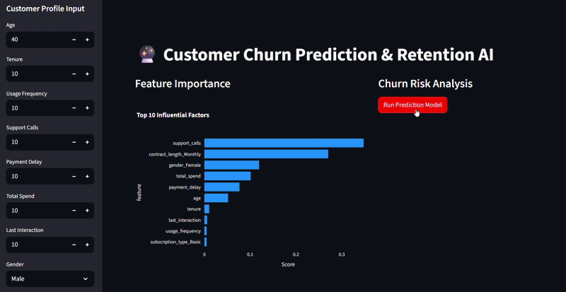
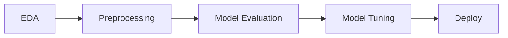
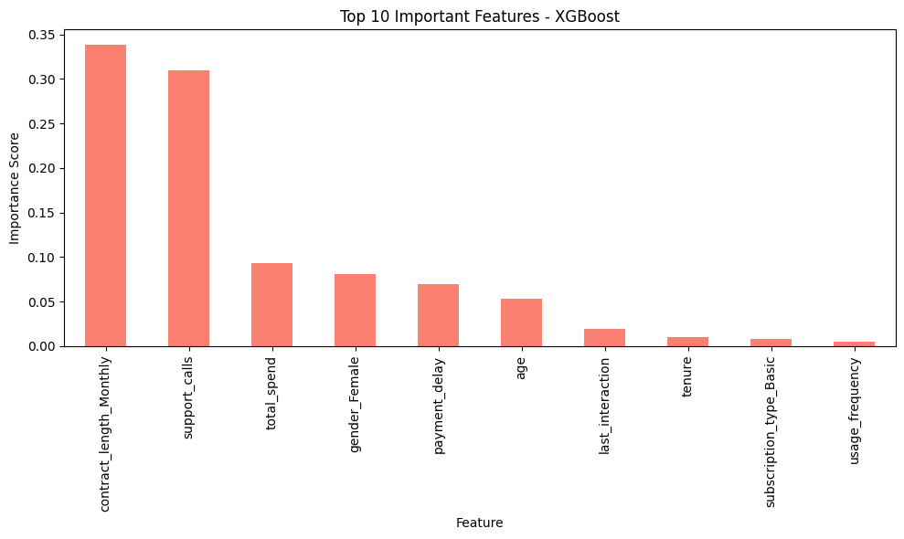
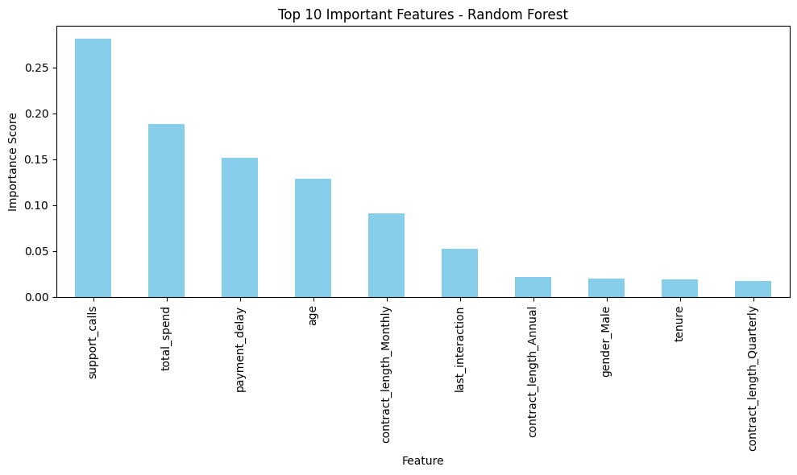

# Customer Churn Analysis and Retention Strategy

[](https://final-project-depi-chsunfeutqmdxxenm9iume.streamlit.app/Data_Exploration)
**Sponsored by:** Egypt Ministry of Communications and Information Technology (MCIT) & Digital Egypt Pioneers Initiative (DEPI)


## 📑 Table of Contents
- [About the Project](#-about-the-project)
- [App Demo](#-app-demo)
- [Key Features](#-key-features)
- [Project Architecture](#-project-architecture)
- [Tech Stack](#-tech-stack)
- [Dataset Info](#-dataset-info)
- [Model Performance](#-model-performance)
- [AI Retention Assistant](#-ai-retention-assistant)
- [Business Insights & Retention Strategy](#-business-insights--retention-strategy)
- [Future Work](#-future-work)
- [Installation & Usage](#-installation--usage)
- [Project Structure](#-project-structure)
- [Team Structure](#-team-structure)

## 📖 About the Project

In the highly competitive telecommunications industry, customer retention is paramount. **Customer acquisition costs are significantly higher than retention costs**, making the ability to accurately forecast and mitigate churn a key competitive advantage.

This project delivers an end-to-end machine learning solution designed to predict customer churn proactively. By analyzing customer behavior, usage patterns, and support interactions, we identify at-risk customers and provide actionable insights to save revenue and improve customer satisfaction.

## 📱 App Demo

Experience the real-time interaction of our Streamlit application:



## 🚀 Key Features

*   **Interactive Data Exploration:** Deep dive into customer demographics, payment behaviors, and service usage patterns.
*   **Real-time Prediction:** Instant churn probability assessment for individual customers via a user-friendly interface.
*   **AI-Powered Retention:** Integrated Generative AI to assist in retaining high-risk customers.
*   **Business Insights:** Data-driven recommendations to reduce churn rates.

## 🧩 Project Architecture

The project follows a structured data science pipeline:



## 🛠️ Tech Stack


## 📊 Dataset Info

The project utilizes the [**Kaggle Customer Churn Dataset**](https://www.kaggle.com/datasets/muhammadshahidazeem/customer-churn-dataset), containing comprehensive data on customer interactions and service usage.

**Key Features:**
*   **Demographics:** `Age`, `Gender`
*   **Account Info:** `Tenure`, `Subscription Type`, `Contract Length`, `Total Spend`
*   **Usage Metrics:** `Usage Frequency`, `Last Interaction`
*   **Support & Payment:** `Support Calls`, `Payment Delay`
*   **Target:** `Churn` (1 = Churned, 0 = Retained)

## 🏆 Model Performance

We evaluated three robust machine learning models. **XGBoost** was selected as the final model due to its superior balance of precision and recall.

| Model | Accuracy | Precision | Recall | F1-Score | ROC-AUC |
| :--- | :--- | :--- | :--- | :--- | :--- |
| **Logistic Regression** | 84.77% | 87.45% | 84.82% | 86.12% | 90.72% |
| **Random Forest** | 93.49% | 89.75% | 99.68% | 94.46% | 95.22% |
| **XGBoost (Best Model)** | **93.36%** | **89.76%** | **99.41%** | **94.34%** | **95.32%** |

### Feature Importance
Understanding *why* customers churn is as important as predicting *if* they will churn.

| XGBoost Feature Importance | Random Forest Feature Importance |
| :---: | :---: |
|  |  |

## 🤖 AI Retention Assistant

We have integrated **Google Gemini 2.0 Flash** (via Google AI Studio) to act as an intelligent retention agent.

*   **Trigger:** When the model predicts a churn probability **> 50%**.
*   **Action:** The AI assistant automatically activates within the Streamlit interface.
*   **Goal:** It analyzes the specific customer's pain points (e.g., "High Support Calls") and generates a personalized, empathetic script and special offer to help the support agent calm the customer and prevent churn.

## 💡 Business Insights & Retention Strategy

Our analysis reveals that **Recall** is the most critical metric for this business case. A high recall score (approx. **99%** with our best models) ensures that we identify almost **all** potential churners.

*   **Proactive Support:** Customers with >5 support calls have a near-100% churn rate. Immediate intervention is required for these cases.
*   **Payment Delays:** Delays beyond 20 days are a strong churn signal. Automated reminders and flexible payment plans can mitigate this risk.
*   **Contract Strategy:** Monthly contract holders are more volatile. Incentivizing annual contracts can stabilize the customer base.

## 🔮 Future Work

1.  **Integration with Live Database:** The current application uses static input. Future work should focus on integrating the Streamlit application with a live company database (e.g., PostgreSQL or SQL Server) to enable real-time, automated risk scoring for the entire customer base, moving from a reactive tool to a proactive monitoring system.
2.  **Model Retraining Automation:** The model's performance will naturally decay as customer behavior evolves. A quarterly model retraining pipeline should be established, utilizing new data to ensure the model remains highly predictive and captures emerging churn drivers.
3.  **Customer Dashboard Implementation:** Enhance the Streamlit application by adding a customer dashboard feature. This would allow business managers to visualize churn trends over time, track the success of retention campaigns, and view the feature importance scores dynamically, providing deeper business intelligence.

## 💻 Installation & Usage

### Option 1: Live Demo
Access the deployed application directly in your browser:
[**🚀 Launch App**](https://final-project-depi-chsunfeutqmdxxenm9iume.streamlit.app/Data_Exploration)

*Note: You can input customer data manually in the sidebar to get real-time predictions.*

### Option 2: Local Installation

1.  **Clone the repository:**
    ```bash
    git clone https://github.com/nadahafez2670/Final-project-DEPI.git
    cd Final-project-DEPI
    ```

2.  **Install dependencies:**
    Create a `requirements.txt` file with the following content and install it:
    ```text
    streamlit
    pandas
    numpy
    scikit-learn
    xgboost
    joblib
    plotly
    matplotlib
    seaborn
    openpyxl
    google-generativeai
    ```
    ```bash
    pip install -r requirements.txt
    ```

3.  **Run the Application:**
    Navigate to the notebooks directory and run the Streamlit app:
    ```bash
    cd Notebooks
    streamlit run 1_🏢_Project_Overview.py
    ```

## 📂 Project Structure

```text
Final-project-DEPI/
├── assets/                             # Project Images & Demo Assets
│   ├── project_cover.jpg
│   ├── Evidence.gif
│   ├── feature_importance_xgboost.png
│   └── feature_importance_rf.png
├── Data/                               # Raw and processed datasets
│   ├── customer_churn_dataset-testing-master.csv
│   ├── customer_churn_dataset-training-master.csv
│   ├── test_cleaned.csv
│   └── train_cleaned.csv
├── Notebooks/                          # Jupyter Notebooks & Streamlit App
│   ├── 1_🏢_Project_Overview.py        # Main Streamlit Entry Point
│   ├── Final_Project.ipynb             # Main Analysis Notebook
│   ├── Milestone1_1.ipynb              # Development Notebook
│   ├── Streamlit/                      # Streamlit Pages & Assets
│   │   ├── 2_📊_Data_Exploration.py
│   │   ├── 3_🖥️_ML_Models_Overview.py
│   │   ├── 4_🔮_Churn_Prediction.py
├── Project Documentation/              # Additional Documentation
└── README.md                           # Project Documentationion
```

## 👥 Team Structure

| Name | Role | Contact |
| :--- | :--- | :--- |
| **Yakoot Shaker Naseem** | **Team Leader**; Model Building & Evaluation | yakoot537@gmail.com |
| **Nada Ahmed Ahmed** | Data Exploration & EDA | |
| **Abd Elrahman Ayman Abdo** | Data Preprocessing & Cleaning | |
| **Nancy Nabil Mohamed** | Model Tuning & Interpretation | |
| **Ahmed Rashad Elsaid** | Deployment & Retention Strategy | |

---
*Developed under the Digital Egypt Pioneers Initiative (DEPI) 2025.*
